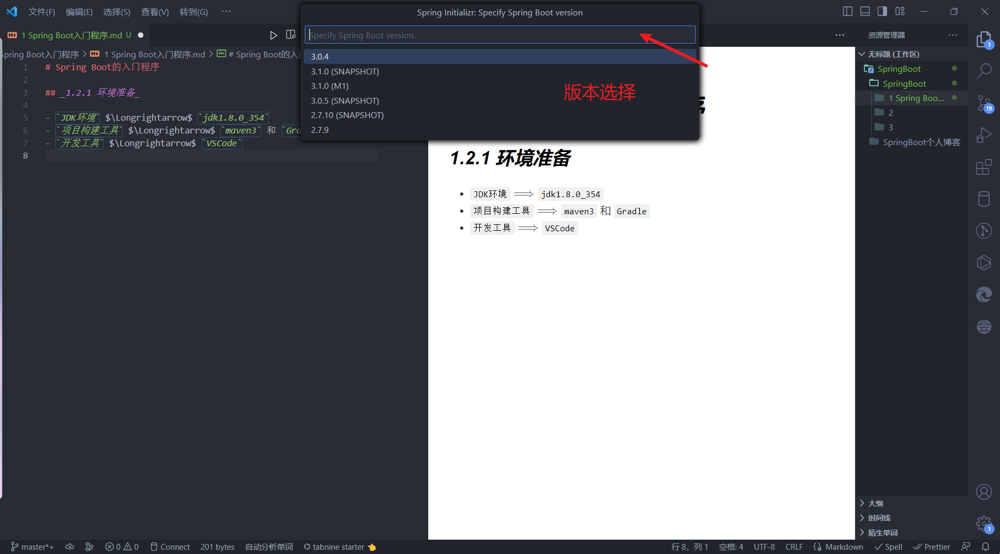

# Spring Boot的入门程序

## _1.2.1 环境准备_

- `JDK环境` $\Longrightarrow$ `jdk1.8.0_354`
- `项目构建工具` $\Longrightarrow$ `maven3` 和 `Gradle`
- `开发工具` $\Longrightarrow$ `VSCode`

## _1.2.2 Spring Boot的项目构建_

1. **选择命令框**
   
2. **输入spring boot initializr查找构建maven项目命令**
    
3. **选择maven版本和jdk版本，自己写组织名**
   
   
   
   **什么是groupid和artifactId？**
    &emsp;&emsp;groupid和artifactId被统称为“坐标”
    &emsp;&emsp;是为了保证项目唯一性而提出的，如果你要把你项目弄到maven本地仓库去，你想要找到你的项目就必须根据这两个id去查找。
　　groupId一般分为多个段，第一段为域，第二段为公司名称。域又分为org、com、cn等等许多，其中org为非营利组织，com为商业组织。举个apache公司的tomcat项目例子：这个项目的groupId是org.apache，它的域是org（因为tomcat是非营利项目），公司名称是apache，artigactId是tomcat。
4. **项目创建结果**
   
   
5. **pom.xml依赖选择**

   
   
   
   _\<parent>标签中添加的spring-boot-starter-parent依赖是Spring Boot框架集成项目的统一父类管理依赖，只有添加它才可以使用Spring Boot的相关特性。其他依赖的解释建议自己去查_
6. **编写主程序以及控制类**
   
   
   
7. **关于运行时的建议**
   - _jdk的选择出现问题_
   - _controller类目录必须放在主程序启动的同级目录上，不然无法被@SpringBootApplication注解识别。_
   - _依赖的选择会导致我们看到的页面不同，security依赖会导致我们需要登录，最好先从最基础的依赖开始，只需要选择parent、web、打包插件以及maven的groupid和ArtifactId等基础的条件即可，后续我们进行单元测试和热部署。_
8. **运行结果展示**
   
  **怎么运行？**
   _选择Spring Boot DashBoard_
   
   _选择运行按钮_
  
